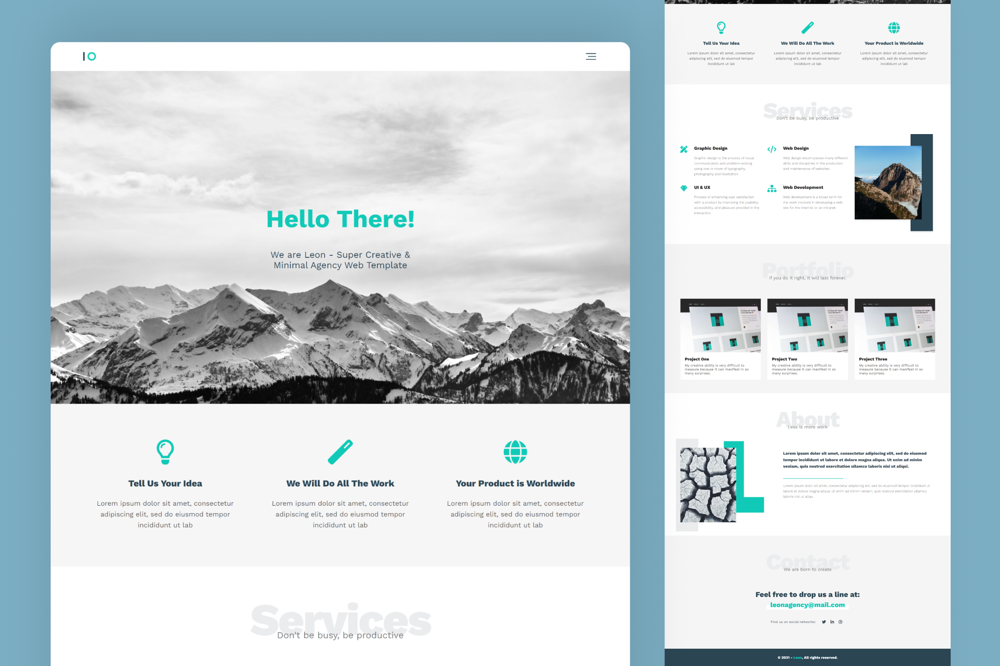

<h1 align='center'>Leon Agency Website</h1>

This project is a landing page for a digital agency by turned a PSD web template into a responsive website using HTML and CSS. It showcases the agency's portfolio, services, and expertise with a clean design and easy navigation for users on all devices. The project has been finished while learning HTML and CSS from [Osama Elzero](https://www.linkedin.com/in/osamaelzero) at [Elzero Academy](https://elzero.org).

## Preview

## Live Demo
👁 [Click here](https://mohammadjarabah681.github.io/leon-agency-website) to check out the live demo!

## Technologies
* HTML
* CSS (with BEM Methodology)

## Features
* ⭐ Single page design
* 👓 Elegant favicon
* 🤖 Responsive design on all devices
* ⚡ Fast and lightweight design
* 🍔 Custom hamburger menu with simple animation
* 🌐 Sections for Features, Portfolio, About, and Contact
* 🎨 SVG logo & icons
* 🌱 Smooth scroll for navigation bar links
* ✨ And more!

## Credits
* PSD Template is from [Graphberry](https://www.graphberry.com)
* Fonts are from [Google Fonts](https://fonts.google.com)
* Images are from [Unsplash](https://unsplash.com)
* Font Icons are from [Font Awesome](https://fontawesome.com)

## License
This project is licensed under the [MIT License](./LICENSE).