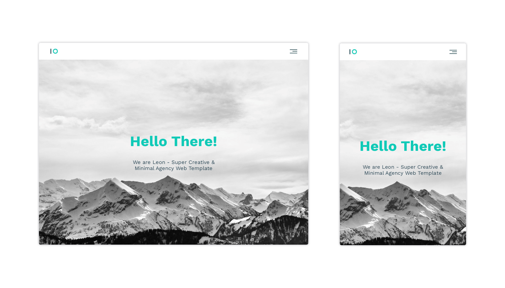

<h1 align='center'>Leon Agency Website</h1>

A portfolio website for Leon agency created with HTML and CSS!

**Note:** In this project, I turned the Photoshop design (PSD template) into a website as practicing on front-end technologies.

## Design View

## Live Demo
👁 [Click here](https://mohammadjarabah.github.io/leon-agency-website) to check out the live demo!

## Technologies Used
* 
*  (CSS code was written following to BEM methodology)

## Features
* ⭐ Single page design
* 👓 Elegant favicon
* 🤖 Responsive design on all devices
* ⚡ Fast and lightweight design
* 🍔 Custom hamburger menu with simple animation
* 🌐 Sections for Features, Portfolio, About, and Contact
* 🎨 SVG logo & icons
* 🌱 Smooth scroll for navigation bar links
* ✨ And more!

## Credits
* PSD Template is from [Graphberry](https://www.graphberry.com)
* Fonts are from [Google Fonts](https://fonts.google.com)
* Images are from [Unsplash](https://unsplash.com)
* Font Icons are from [Font Awesome](https://fontawesome.com)
* README Badges are from [Badges 4 README.md Profile](https://github.com/alexandresanlim/Badges4-README.md-Profile)
